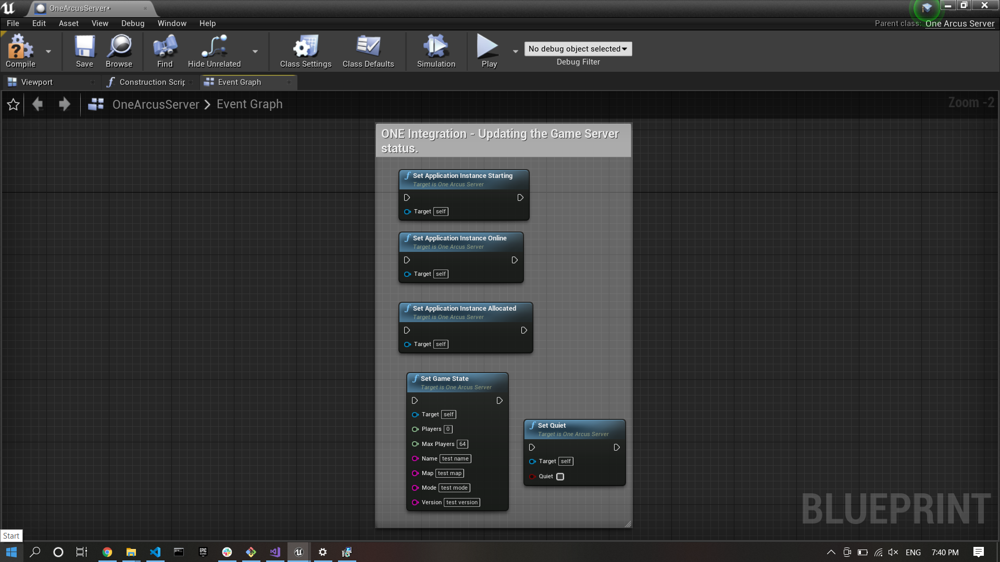

# one-gamehosting-sdk-unreal

This Unreal Engine Plugin provides access to `i3D.net` ONE Game Hosting SDK, for easy and efficient scaling of game servers!

The `i3D.net` Game Hosting SDK works on Windows and Linux.
If something doesn’t work, please [file an issue](https://github.com/i3D-net/ONE-GameHosting-SDK/issues).

## Overview

The documentation for the entire ONE Platform can be found [here](https://www.i3d.net/docs/one/). This plugin provides the required public headers files as described [here](https://git.i3d.net/one/ardentblue/one-game-sdk/-/blob/master/docs/integration_guide.md), as well, as the required internal implementation which can be found [here](https://git.i3d.net/one/ardentblue/one-game-sdk/-/tree/master/one/arcus).

## ONE Game Hosting SDK Plugin

The `ONE Game Hosting SDK Plugin` provides ONE Game Hosting SDK directly in the Unreal Engine. More information about the ONE Game Hosting SDK can be found [here](https://www.i3d.net/docs/one/odp/).

More specifically, this plugin contains the `Arcus V2` protocol implementation for game integration. More information about the `Arcus V2` can be found [here](https://www.i3d.net/docs/one/odp/).

### Plugin Anatomy

The plugin provide the plubic C API headers needed to use `Arcus V2` so they could be use directly in your game `C++` implementation. The plugin also contains the private `C++` implementation of the `Arcus V2` protocol and requires no third party `dll`.

### SDK Version

The current version of `i3D.net` ONE Game Hosting SDK code used in this plugin is referenced [here](docs/sdk_version.md).

## ONE Game Hosting Plugin

The plugin Provides the `ONE Game Hosting SDK` to the Unreal Engine. More information can be found [here](https://www.i3d.net/docs/one/odp/). More specifically, this plugin wraps the C API provided by the `OneArcusSDKPlugin` with Blueprintable classes for ease of use.

### Anatomy of the plugin

The `Arcus Server` blueprint class in the `Arcus Example` showcase the typical use of the `ONE Game Hosting Plugin` classes. The `Arcus Example` is a minimalist client/server game. In this example the `dedicated server` holds the `Arcus Server` that interacts with the `ONE` agent via the `Arcus V2` protocol.

The typical life cycle (initialization, updates and shutdown) is shown here:  Note, that the `Arcus Server` is not replicated between the `dedicated game server` and the `game client`.

The complete list of the `Arcus V2` messages and their associated payloads can be found [here](https://www.i3d.net/docs/one/odp/Game-Integration/Management-Protocol/Arcus-V2/request-response/). The `Arcus Server` trigger an specific event for each message with their payload.

The `Arcus Server` events and payload parsing is shown here  The `event parsing` example show event payload parsing. The following messages have a fixed payload:
1. `Soft Stop`:
    The simplest payload, consisting of only one integer `timemout` in seconds. The parsing is already done in the `Event Soft Stop Received` for convenience.
2. `Application Instance Information`:
    The Application Instance have a big payload, as seen [here](https://www.i3d.net/docs/one/odp/Game-Integration/Management-Protocol/Arcus-V2/request-response/#applicationinstance-information). For simplicity, only the first few fields are being parsed in the function `Application instance Information Payload Parse` and present in the `Event Application Instance Information Extracted`. One can look into the parse function to find an example on how to parse the other fields as needed.
3. `Host Instance Information`:
    The Host Instance have a big payload, as seen [here](https://www.i3d.net/docs/one/odp/Game-Integration/Management-Protocol/Arcus-V2/request-response/#host-information). For simplicity, only the first few fields are being parsed in the function `Host Information Payload Parse` and present in the `Event Host Information Extracted`. One can look into the parse function to find an example on how to parse the other fields as needed.

The following messages have a a user defined payload:
1. `Allocated`:
    The `Allocated` message payload is user defined, as seen [here](https://www.i3d.net/docs/one/odp/Game-Integration/Management-Protocol/Arcus-V2/request-response/#allocated). For simplicity, the function `Allocated Payload Parse` and `Event Allocated Extracted` mirrors the example payload found in the documentation. One can look into the parse function to find an example on how to parse different payload as needed.
2. `Meta Data`:
    The `Meta Data` message payload is user defined, as seen [here](https://www.i3d.net/docs/one/odp/Game-Integration/Management-Protocol/Arcus-V2/request-response/#meta-data). For simplicity, the function `Meta Data Payload Parse` and `Event Meta Data Extracted` mirrors the example payload found in the documentation. One can look into the parse function to find an example on how to parse different payload as needed.

Finally, the `Arcus Server` provides function to update the game server status to the agent as shown here  Note that he `Set Quiet` is a small helper function to enable or disable more verbose logging as needed.

## Technical Documentation

The target audiance is software developers that want to build the plugin locally without using pre-built plugin from Unreal marketplace. The technical documentation can be foud [here](docs/technical/guide.md).
