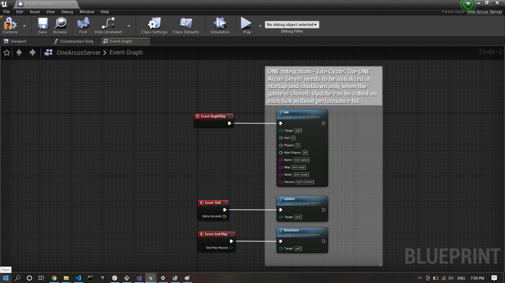
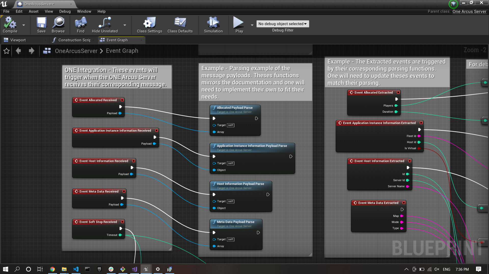
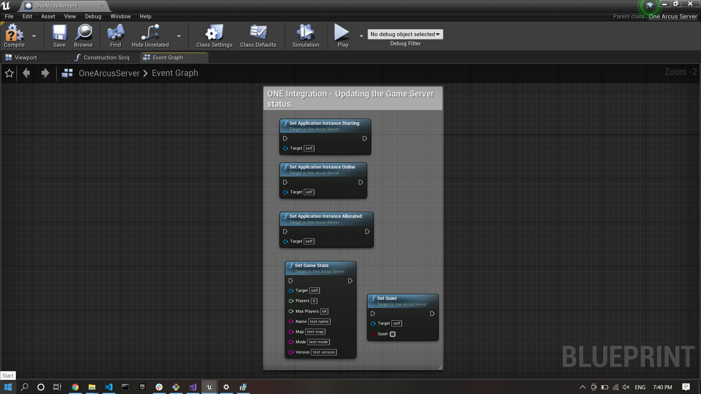

# Developer Setup

Follow the following steps to build the Unreal Plugin and update the Arcus SDK version. The target audiance is software developers that want to build the plugin locally without using pre-built plugin from Unreal marketplace.

## ONE Game Hosting Plugin

The plugin Provides the `ONE Game Hosting SDK` to the Unreal Engine. More information can be found [here](https://www.i3d.net/docs/one/odp/). More specifically, this plugin wraps the C API provided by the `OneArcusSDKPlugin` with Blueprintable classes for ease of use.

The plugin provides the public C API headers needed to use `Arcus V2` so they could be use directly in your game `C++` implementation. The plugin also contains the private `C++` implementation of the `Arcus V2` protocol and requires no third party `dll`.


### Anatomy of the plugin

The `One Arcus Server` blueprint class in the `Arcus Example` showcase the typical use of the `ONE Game Hosting Plugin` classes. The `Arcus Example` is a minimalist client/server game. In this example the `dedicated server` holds the `One Arcus Server` that interacts with the `ONE` agent via the `Arcus V2` protocol.

The typical life cycle (initialization, updates and shutdown) is shown here: . Note that the `One Arcus Server` only should be instantiated and run on the Game Server, not the player game client.

The complete list of the `Arcus V2` messages and their associated payloads can be found [here](https://www.i3d.net/docs/one/odp/Game-Integration/Management-Protocol/Arcus-V2/request-response/). The `One Arcus Server` trigger an specific event for each message with their payload.

The `One Arcus Server` events and payload parsing is shown here  The `event parsing` example show event payload parsing. The following messages have a fixed payload:
1. `Soft Stop`:
    The simplest payload, consisting of only one integer `timemout` in seconds. The parsing is already done in the `Event Soft Stop Received` for convenience.
2. `Application Instance Information`:
    The Application Instance have a big payload, as seen [here](https://www.i3d.net/docs/one/odp/Game-Integration/Management-Protocol/Arcus-V2/request-response/#applicationinstance-information). For simplicity, only the first few fields are being parsed in the function `Application instance Information Payload Parse` and present in the `Event Application Instance Information Extracted`. One can look into the parse function to find an example on how to parse the other fields as needed.
3. `Host Instance Information`:
    The Host Instance have a big payload, as seen [here](https://www.i3d.net/docs/one/odp/Game-Integration/Management-Protocol/Arcus-V2/request-response/#host-information). For simplicity, only the first few fields are being parsed in the function `Host Information Payload Parse` and present in the `Event Host Information Extracted`. One can look into the parse function to find an example on how to parse the other fields as needed.

The following messages have a a user defined payload:
1. `Allocated`:
    The `Allocated` message payload is user defined, as seen [here](https://www.i3d.net/docs/one/odp/Game-Integration/Management-Protocol/Arcus-V2/request-response/#allocated). For simplicity, the function `Allocated Payload Parse` and `Event Allocated Extracted` mirrors the example payload found in the documentation. One can look into the parse function to find an example on how to parse different payload as needed.
2. `Meta Data`:
    The `Meta Data` message payload is user defined, as seen [here](https://www.i3d.net/docs/one/odp/Game-Integration/Management-Protocol/Arcus-V2/request-response/#meta-data). For simplicity, the function `Meta Data Payload Parse` and `Event Meta Data Extracted` mirrors the example payload found in the documentation. One can look into the parse function to find an example on how to parse different payload as needed.

Finally, the `One Arcus Server` provides function to update the game server status to the agent as shown here  Note that he `Set Quiet` is a small helper function to enable or disable more verbose logging as needed.


## SDK update guide

Follow the following instructions to change the version of the i3D.net ONE Game Hosting SDK code used in the plugin:

1. Make sure you have both git repositories cloned locally.
    * SDK repository: `git@github.com:i3D-net/ONE-GameHosting-SDK.git`
    * SDK plugin repository: `git@github.com:i3D-net/ONE-GameHosting-SDK-Unreal.git`
2. Make sure that the sdk repository has the wanted SDK version checked out.
3. Run the following script:
```bash
${PATH_OF_SDK_PLGUIN_REPOSITORY}/tools/update.sh ${UNREAL_MAJOR_VERSION} ${UNREAL_ENGINE_VERSION} ${PATH_OF_SDK_REPOSITORY} ${PATH_OF_SDK_PLGIN_REPOSITORY}
```
Note: make sure to omit the trailing slash at the end of the path. For example:
```bash
./tools/update.sh 4.x 4.26 202212 ~/src/one-game-sdk ~/src/one-gamehosting-sdk-unreal
```
4. Commit the changes in the SDK plugin repository.

Note that the update script will update the `${PATH_OF_SDK_PLGUIN_REPOSITORY}/docs/sdk_version.md` automatically.

